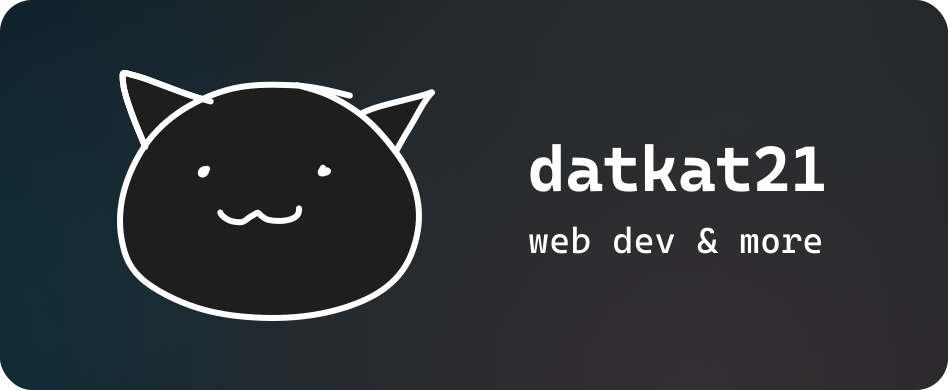

# 

<a id="hello-there">
<picture>
  <source media="(prefers-color-scheme: dark)" srcset="assets/headings/hellothere-light.svg">
  
</picture>
 

I'm Kat21, a web developer and designer based in the United States.   
I enjoy programming in JavaScript/TypeScript, PHP and more!

<blockquote><small>Pronouns: <code>he/him</code>&mdash;yes, I'm male</small></blockquote>

<a id="why-kat21">
<picture>
  <source media="(prefers-color-scheme: dark)" srcset="assets/headings/whyname-light.svg">
  
</picture>
 

The name *kat* comes from an old username of mine from 2015. It just means _cat_, but with a K, hence "Kat".

The *21* in Kat21 is also from around the same time when Vine was getting popular. There was a meme called "*9 + 10 = 21*", which got really popular due to the kid featured in it being silly for what he said.

Around 2019, I decided to incorporate *21* into my name because it just fit in pretty well, and having the same name of _DaCuteKittyKat_ (yes, that's the name from 2015, I was young at the time) for so long would not be that much fun.

<a id="my-projects">
<picture>
  <source media="(prefers-color-scheme: dark)" srcset="assets/headings/myprojects-light.svg">
  
</picture>
 

Below is a couple of my favorite projects:

* [Chatify](https://github.com/datkat21/chatgpt-chatify) — A modern ChatGPT UI but with custom prompts, lots of customization options and more! *(Uses your own API key.)*
* [Pluto](https://github.com/datkat21/pluto-web-os) — A modern &laquo;web OS&raquo; that has a file system, a collection of built-in apps, and other things.

Here's a list of older projects (that won't get updates) that other people use:

* [PowerPoint Discord Rich Presence](https://github.com/datkat21/PowerPoint-Discord-RPC)    
  A Microsoft PowerPoint add-in that enables Discord Rich Presence using [DiscordRPC for C#](https://github.com/Lachee/discord-rpc-csharp).

<a id="contact-me">
<picture>
  <source media="(prefers-color-scheme: dark)" srcset="assets/headings/contactme-light.svg">
  
</picture>
 

You can reach me on Discord at [`kat21`](https://discordapp.com/users/352651395683319821) or via e-mail: [kat@cherries.to](mailto:kat@cherries.to)

<a id="my-setup">
<picture>
  <source media="(prefers-color-scheme: dark)" srcset="assets/headings/mysetup-light.svg">
  
</picture>
 

My PC is quite performant if I were only using it for development, but I also use it for gaming.

I use a prebuilt, specifically the [Alienware Aurora R9](https://www.dell.com/en-us/shop/gaming-and-games/alienware-aurora-r9-gaming-desktop/spd/alienware-aurora-r9-desktop). I may build a PC in the future if I want to.

Peripherals are shown below:

| Type         | Device                               |
| ------------ | ------------------------------------ |
| Keyboard     | Razer Huntsman Analog                |
| Mouse        | Logitech G502 Hero                   |
| Microphone   | Blue Yeti Nano                       |
| Headset      | SteelSeries Arctis Nova Pro Wireless |
| Capture Card | Elgato HD60 S+                       |
